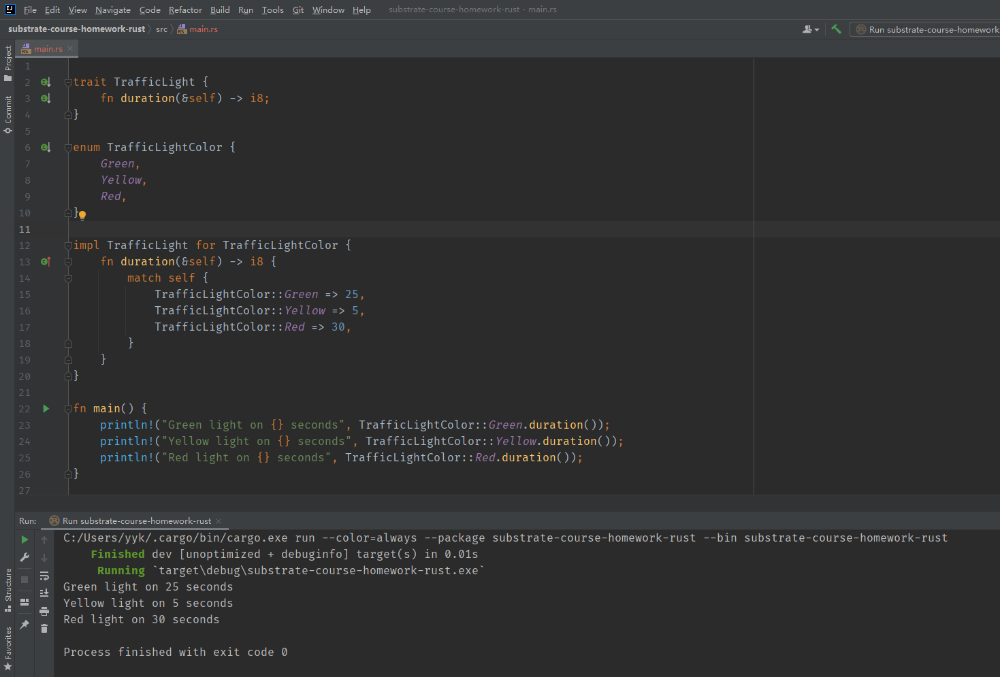

https://doc.rust-lang.org/book/ch14-03-cargo-workspaces.html | Cargo Workspaces - The Rust Programming Language
https://doc.rust-lang.org/book/ch06-01-defining-an-enum.html | Defining an Enum - The Rust Programming Language
https://doc.rust-lang.org/book/ch06-02-match.html | The match Control Flow Operator - The Rust Programming Language
https://internals.rust-lang.org/t/impl-trait-for-enum-variant/4131/5 | Impl trait for enum variant - Rust Internals
https://stackoverflow.com/questions/51567350/can-traits-be-used-on-enum-types | rust - Can traits be used on enum types? - Stack Overflow
https://www.possiblerust.com/guide/enum-or-trait-object | Enum or Trait Object - Possible Rust

## TODO: create workspace

## enum and trait
